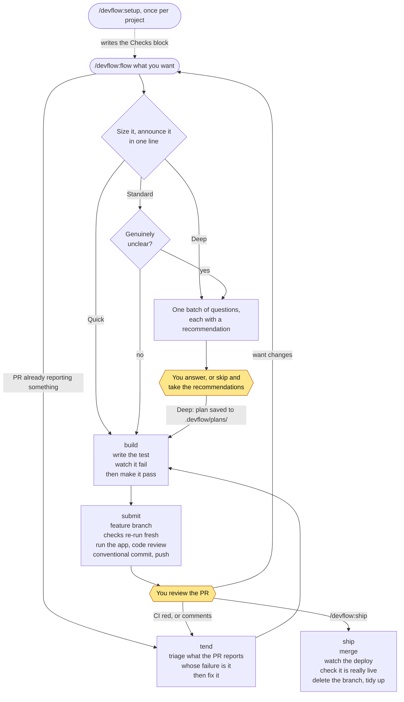

# devflow

One dev loop for features, changes, bug fixes and chores. Sizes the work, tests first, proves it runs, opens a PR — then ships it when you say so. Asks you as little as possible.

This is **Phase 1** — deliberately small. See [What is not here yet](#what-is-not-here-yet).

## The three rules

In order. When two disagree, the higher one wins.

**1. Be correct, above everything else.** If the work is wrong, nothing else matters. When being cheap causes work to be redone, that is a correctness problem wearing a cost costume, not a cost decision.

**2. Ask as little as possible, but not less than that.** Zero questions is not the goal. The fewest interruptions, placed where they matter most, is the goal.

**3. Be cheap where it is a real trade.** Never cheap on code review, hard bugs, or anything on the danger list.

## Install

```bash
/plugin marketplace add eddiechok/agent-devflow
/plugin install devflow@eddiechok-devflow
```

Or install it everywhere at once by adding this to `~/.claude/settings.json`:

```json
{
  "extraKnownMarketplaces": {
    "eddiechok-devflow": {
      "source": { "source": "github", "repo": "eddiechok/agent-devflow" },
      "autoUpdate": true
    }
  },
  "enabledPlugins": { "devflow@eddiechok-devflow": true }
}
```

## Set up a project

Run this once in each project:

```
/devflow:setup
```

It finds the project's test, typecheck and lint commands, **runs them to confirm they work**, then writes a `## Checks` block into the project's `CLAUDE.md`:

```markdown
## Checks
- Test: pnpm test
- Typecheck: pnpm typecheck
- Lint: pnpm lint
```

This block is the **only** thing each project must provide, and it is what makes devflow work with any language. No commands are hardcoded in the plugin — the project is the source of truth.

Any line may repeat. A project with two test commands and no wrapper that runs both gets two `Test:` lines, run in order — two honest lines beat one invented wrapper script. This repo's own [CLAUDE.md](CLAUDE.md) is an example.

There is a second, optional block — `## Deploy` — and you never write it by hand. `ship` offers to add it the first time it deploys and verifies successfully, because that is the only moment anything has proof the command works. `setup` deliberately leaves it alone: its rule is that it runs a command before recording it, and the only way to check a deploy command is to deploy.

Run `/devflow:setup` again if the commands change. It will not overwrite a block you wrote yourself without asking.

Why it runs the commands rather than just writing them down: everything downstream trusts this block. A wrong command here fails silently — `submit` runs something harmless, sees exit 0, and reports the work as proven.

## Use it

```
/devflow:flow add a settings page for email alerts
/devflow:flow #123
/devflow:flow --deep change how sessions are stored
```

Then, once you have looked at the PR and want it finished:

```
/devflow:ship
/devflow:ship 123
```

`flow` sizes the work and routes it. You should not normally need to call the others directly — except `ship`, which is the one skill nothing else can call, and `tend`, which `flow` does route to but which you will usually reach for yourself the moment you see a red check.

### The loop



A second view of the same thing — where work can *sit*, and what is allowed to move it — is in [docs/pipeline.md](docs/pipeline.md). This chart answers what happens next; that one answers where the work is now.

The two amber boxes are the only places you are normally needed. What the chart leaves out, all of it stopping the flow rather than bending it:

- Anything on the **danger list** is forced to at least Standard, and `submit` names `/security-review` in its handoff. That one is a slash command, so only you can start it.
- The **hook asks** before any commit that would land on the default branch.
- **Three failed attempts** at the same problem and `build` stops, saying what each attempt ruled out, rather than trying a fourth.
- If the **live check fails** twice, `submit` stops and does not open a PR. An honest failure beats a green-looking PR over a broken feature.

| Size | For | What happens |
|---|---|---|
| **Quick** | Typos, chores, most bug fixes | Straight to building. No questions. |
| **Standard** | Changing existing behaviour | Questions only if genuinely unclear. |
| **Deep** | New features, wide refactors | One round of questions, then a written plan. |

It announces the size in one line before doing anything, so you can disagree immediately.

### Changing the PR after you have looked at it

`submit` stops at the pull request; you read it and want something different. Go back through `flow`. It checks the branch first, sees the open PR, and treats the request as a **follow-up**: same branch, same PR, and `submit` **updates** it instead of opening a second one.

Follow-up mode reads before it asks. The PR's **Assumptions** and the plan file already hold what you decided the first time, so you are only asked what is genuinely new. Sizing still runs — a follow-up can be anything from a typo to a rethink — and the danger list still applies.

If what you want changed is something the **PR itself is reporting** — a check went red, a reviewer asked for something — `flow` hands it to `tend` rather than taking it into `build`. Not every failure a pull request reports belongs to that pull request, and `tend` is the step that asks whose it is before anything gets pushed.

If the request turns out to be new work rather than a change to that PR, `flow` says so and starts a fresh branch. Where the branch is pinned and it cannot, it asks you which you meant.

### Where a Deep plan goes

Deep work writes its plan into the project, at `.devflow/plans/<short-name>.md`. It holds the assumptions taken and the pieces to build, each marked as depending on another piece or not.

That file is the spec, not a progress tracker. Its job is to hold the assumptions and the pieces, and to be what `review`'s second axis judges the work against.

**A plan is resumable, and the record is `git log`, not the file.** `build` commits each piece as it goes green, so you can `/clear` between pieces and pick up from the plan plus the log: the plan says what the pieces are, the log says which of them exist. Nothing has to remember to tick a box — which is the reason to trust it, and the reason the checkbox version of this was rejected.

Commit it or ignore it, as you prefer — devflow neither adds it to `.gitignore` nor expects it there.

### If it sizes something wrong

```
/devflow:flow --deep <request>
/devflow:flow --quick <request>
```

Overrides are recorded to `~/.claude/devflow/overrides.md` — **globally, not per project**, because they are notes about this plugin rather than about any one repo, and they are only useful reviewed together.

`flow` also prints the line it wrote. On a hosted session that home directory is inside a container which is deleted when the session ends, so the file does not survive and the reply is the only copy — worth pasting somewhere durable if you work on the web.

Each line is a real example of the classifier getting it wrong, with your correction. After a month you have a set of labelled cases from actual use, which beats any examples invented up front. Do not delete the file.

This is the only self-improvement machinery in Phase 1, and it is deliberately just collection — there is no review step yet. Read the file when it has twenty or so lines in it and see whether a pattern is there. If one is, that is a change to `flow`, made through the normal flow, since this repo is just another project.

## The skills

| Skill | What it does |
|---|---|
| `setup` | Once per project: finds and verifies the check commands. Invoked by you only, so it costs nothing at runtime |
| `flow` | Sizes the request, routes it, asks any questions in one batch |
| `build` | Test first, watch it fail for the right reason, then make it pass |
| `review` | Two axes in fresh agents — is it built right, is it the right thing — reported side by side, never blended |
| `submit` | Runs the checks fresh, runs the app, calls `review`, commits, opens the PR — or updates the one already open. **Never merges.** |
| `tend` | After the PR is open: works out what a red check or a review comment is really saying, whether this branch caused it, then fixes it and re-submits |
| `ship` | Merges it, watches the deploy, checks it is really live, cleans up. **Only you can start it** |

## The agents

`review` does not review. It pins the range, finds the spec, and spawns these two, which have never seen the session that wrote the code:

| Agent | Axis | What it does |
|---|---|---|
| `reviewer` | Is it built right | Reads the whole branch — committed and not — and reports only findings it can attach a concrete failing case to |
| `spec-reviewer` | Is it the right thing | Reads the plan or issue and reports what is missing, what was built wrong, and what nobody asked for. Runs only when a spec exists |

The two reports are printed side by side and **never merged or ranked against each other**. A change can follow every rule in the repo while building the wrong thing; a blended verdict lets the passing axis hide the failing one.

Both are agents rather than prompt templates, so their limits are real rather than requested: `tools:` grants read, grep, glob and bash, so neither one can edit a file or start another agent. Both also pin `model: opus` and `effort: xhigh`, so a review does not quietly become a cheaper review because of what you happened to have `/model` set to — an under-powered review still prints, and still reports nothing wrong. They pin the **same** pair deliberately: the two reports are never ranked against each other, and a weaker model on one axis would rank them without saying so. Where every step came from is in [docs/provenance.md](docs/provenance.md).

### Why `submit` does not run `/code-review`

It used to say it did. It could not, for three separate reasons, and the failure was silent in the worst way: the instruction sat in the skill looking like a review had happened.

- The plugin **may not be installed**. `submit` asserted it was.
- `/code-review` is a **slash command**. A skill cannot type one at itself, so nothing on the automatic path can start it.
- It reviews an **open pull request** and comments back on it. `submit` called for it at step 5, four steps before a PR exists.

So the work split by what can actually run where. `review` is a skill and its two axes are agents, all three of which a skill *can* start, and they read a working tree — that is step 5. `/code-review` gets handed to you at step 8, with the PR number, once there is a PR for it to read. Neither one pretends to be the other.

### `ship` changed meaning — read this once

`ship` used to mean *open a pull request and stop*. That job is now **`submit`**. `ship` is now the skill that merges and deploys.

The word moved onto a more dangerous action, so the old habit is worth breaking deliberately:

- Type `/devflow:ship` on a branch with **no PR** and it stops, pointing you at `submit`. The habit is caught.
- Type it where a **PR already exists** and it merges. Nothing catches that one.

## When it will ask you

**Direction** — Deep jobs always, Standard only when genuinely unclear, Quick never. All questions come at once, each with a recommended answer. `yes to all` is a valid reply. Anything you skip takes the recommendation and appears in the PR under **Assumptions**.

**Merge** — always yours. `submit` opens the PR and stops. `/devflow:ship` does everything after it, and it is the one skill you have to start yourself: `disable-model-invocation: true` keeps it out of the automatic path, and `flow` and `submit` are both told never to call it.

**Committing to the default branch** — the hook asks first.

That is it. A one-line bug fix asks you nothing until merge.

## The danger list

These always get at least Standard size, a human check, and a security review:

login and permissions · secrets and keys · payments · database migrations · public APIs · CI/CD config · deleting or weakening tests · anything that cannot be reverted

## Escape hatches

| You want | Do this |
|---|---|
| See the full output of a check | add `--verbose` to the command |
| Skip the commit guard | append `# devflow-ok` to the command |
| Force a bigger or smaller process | `/devflow:flow --deep` or `--quick` |

## On Claude Code on the web

The plugin installs and loads the same way there — put the `extraKnownMarketplaces` and
`enabledPlugins` block in the repo's own `.claude/settings.json` and it comes with the
clone. But the web harness writes instructions of its own into the system prompt, and
three of them sit on top of devflow's steps.

**You have to type `/devflow:flow` yourself.** This is the one the plugin cannot fix. A web
session opens with a task description telling it to make the change, commit and push —
a complete loop, already given, before any skill is consulted. A skill description does not
outrank it. Left alone, the session does the work well and does none of devflow: in the run
that prompted this section it invoked zero skills, ran no review, never opened the site, and
opened no PR.

**The review has to be asked for.** The harness says not to start an agent unless the human
asked, and both review axes are agents. `review` now says so in one line and asks; say
**"run the review"** and both start. If nothing is said the axes report `NOT RUN`, which
`submit` carries into the PR under **Known issues**. A blocked review is never a clean one.

**The PR is already asked for.** The harness says not to open a pull request unless the
human explicitly asked. Invoking `submit` — or `flow`, which ends in it — *is* that request,
and `submit` says so rather than stopping to ask twice.

**Your branch is already made.** The harness creates it and forbids pushing anywhere else,
so `build` keeps it instead of making a `<type>/<short-name>` one. Off the default branch was
always the real requirement; the naming was never the point.

**There is no `gh`.** The web sandbox reaches GitHub through an MCP server instead, so every
`gh` command in these skills names *what to ask for*, not *how to ask*. `ship` used to report a
missing CLI as `none for this branch` — the same words it uses for a branch with no pull
request — and would send you to `submit` for work that already had one open. It now tells the
two apart.

Nothing here detects the harness. Every rule is written to be true in both places.

## About the hook

`hooks/bash-guard.py` does three things, all cheap and all worth knowing about:

**Trims long check output.** A 500-line test run becomes about 40 lines. On failure it shows **more**, not less — the matching failure lines plus the last 40 — because a failing command is exactly when you want detail. The exit code is always printed as `exit=N`.

**Allows the commands it trims.** It has to. Claude Code checks permissions against the command the hook hands back, not the one Claude typed, and no `Bash(...)` rule can match a compound statement. Without this, `npm test` is refused however you write your rules — and Claude does not stop, it quietly runs `node --test` instead, going around the command your `## Checks` block named. So the hook carries the decision itself.

Only a single, simple call to a known check runner ever gets that far. The command must match the built-in list (`npm test`, `pytest`, `cargo test`, `go test`, `tsc`, and friends) and contain no `&&`, `||`, `;`, `|`, newline, `$(` or backtick. Anything else passes through untouched and faces your normal rules.

This is why `build` and `submit` both insist on running check commands **bare**, one per call. A command Claude has already shaped — `npm test 2>&1 | tail -20` — makes the hook stand down, so you lose the trimming and the `exit=N` line, and Claude ends up hand-rolling an exit code instead. Which it gets wrong: `${PIPESTATUS[0]}` after a `;` printed nothing at all in a real run.

**Asks before committing to the default branch.** It asks rather than blocks. A wrong ask costs one keypress; a wrong block stops your work.

> **This is an ergonomic speed bump, not a security control.** It matches text in command strings and is trivially bypassed by variable indirection, aliases, or a different binary. It stops accidents, not attackers. It also fails open: any error and your command runs unchanged.
>
> **Note which way the trimming grant points.** For that narrow set of commands the hook *gives* permission rather than withholding it, and a hook allow beats your own settings — a `"deny": ["Bash(npm:*)"]` entry does **not** stop it. Tested, not assumed. `npm test` runs whatever `package.json` says, so this is a real grant, even if a small one. If you would rather keep that decision, drop the `PreToolUse` entry from `hooks/hooks.json`; you lose the trimming and get the prompts back.

## Validating changes to this plugin

```bash
claude plugin validate .
```

Changed the hook? Run its contract tests — they take under a second and cost
nothing:

```bash
python3 hooks/test-bash-guard.py
```

Changed a skill's frontmatter? Same deal, same second:

```bash
python3 skills/test-frontmatter.py
```

It checks that every `description` reaches the model whole. In a plain YAML
scalar a `#` preceded by a space opens a comment, so `... like #123 ...` quietly
cut 60 characters off `flow`'s description — including "This is the entry point,
start here.", the sentence most likely to make the skill fire. The file read
correctly the whole time. Quoting the value fixes it; this test stops it coming
back, and refuses to pass by finding no skills.

Expect **exactly one warning**, about the missing `version` field. That is deliberate: with no version, `/plugin update` picks up every push. If you set one, updates silently stop arriving until you remember to bump it.

Do **not** use `--strict` — it turns that intentional warning into an error. If you ever see a second warning, something is genuinely wrong.

## What is not here yet

Phase 1 is deliberately the smallest useful thing. Deliberately absent:

- A standalone `plan` skill. Deep work already writes `.devflow/plans/<name>.md` and resumes from it, but there is no way to invoke planning on its own, revise a plan once written, or tidy up old ones.
- `debug` — the disciplined bug-fixing loop. For now bugs go through `build`.
- The `hardcase` agent — a second, adversarial read that tries to refute what `reviewer` found. For now one review is the whole review.
- Model routing by size. The two agents pin a model; the six skills inherit whatever you are on. `flow` picks Quick, Standard or Deep at runtime, but a skill's `model:` is fixed on disk, and a skill cannot type `/model` at itself — the same wall `/code-review` hit. Routing the sizes would mean a skill per size, which is three copies of `flow` to keep in step.
- Cleanup of worktrees and folder copies. `ship` handles branches, dev servers and temp files; copies of the repo are still yours.
- Capturing lessons.

These are only worth building if two weeks of real use shows you need them. Each one that gets added should be added because you hit the problem, not because it sounded good.

## Borrowed from

Ideas adapted, with thanks:

- **[obra/superpowers](https://github.com/obra/superpowers)** (MIT, and Apache-2.0 as the packaged plugin) — watch the test fail first; prove it before saying done; the three-size classifier, **with its "never go lighter" rule deliberately inverted**; never volunteer discard. From `requesting-code-review` and `receiving-code-review`: give the reviewer crafted context and never the session's history, review the work against its plan, and treat findings as suggestions to evaluate rather than orders to follow — which is why `submit` can reject one in writing.
- **[mattpocock/skills](https://github.com/mattpocock/skills)** (MIT) — ask every question in one round with a recommendation attached; test only at agreed seams. From its `code-review` skill: **the two axes and the refusal to blend them**, scope creep as a finding in its own right, proving the fixed point resolves before spawning anything, and reporting "no spec available" rather than inventing requirements. Its twelve-smell baseline was **not** taken: it is judgement-call territory by design, which is the opposite of `reviewer`'s bar.
- **[wshobson/commands](https://github.com/wshobson/commands)** (MIT) — the shape of a git workflow that fits in a few lines.
- **Anthropic's [`code-review`](https://github.com/anthropics/claude-plugins-official) plugin** (Apache-2.0) — `reviewer`'s "Do not report" list is its false-positive taxonomy, rephrased: pre-existing problems, pedantic nitpicks, anything a linter or typechecker already catches, quality gripes no `CLAUDE.md` asked for. Its confidence filter is **reworked, not copied** — a 0-100 score across five bands, dropped below 80, became one question: can you name the input that fails? Its five review lenses were not carried over; `reviewer` uses four of its own.
- **Anthropic's `feature-dev` plugin** (Apache-2.0) — reviewed for patterns only, nothing taken.

## License

MIT. See [LICENSE](LICENSE).
