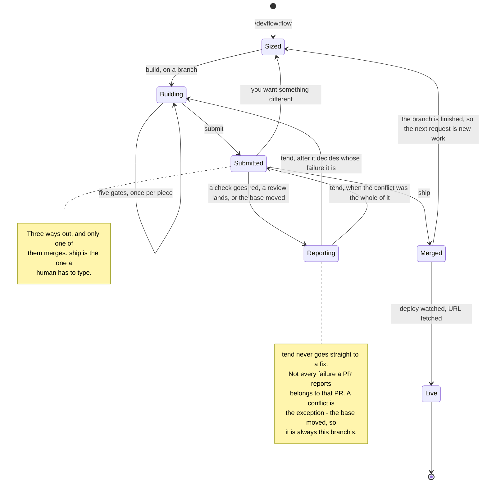
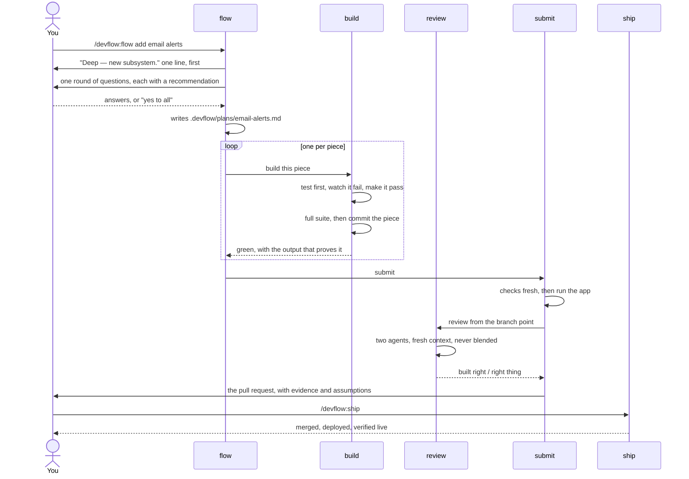

# The pipeline

Where a change can be. And which skill is allowed to move it.

## Why this is a state diagram

The README draws a flowchart. A flowchart answers *what happens next*.

That was the right question while the loop ran in one direction. It went `flow`, `build`,
`submit`, stop.

It stopped being the right question once the loop learned to come back. Work can now
return from an open pull request three separate ways. A top-down flowchart draws those as
back-edges crossing the page. The picture gets harder to read exactly where the plugin got
more capable.

A state diagram asks a different question. **Where can this work be sitting right now, and
what gets it out of there.** That turns out to be the question this plugin is actually
about.

Every hole found in the audit was a missing transition. There was no way back from an open
PR. There was no way out of a red check. A state diagram shows those as a state with no
exit.

A flowchart hides them. A line that was never drawn looks the same as a line that does not
exist.

Use the right one for the question. Sizing is a decision procedure, so the README's
flowchart still suits it. The pipeline is a lifecycle, so it gets this.

## The work

**`Merged --> Sized` is the edge that was missing longest.**

A branch whose pull request has merged looks, from `git`, exactly like a branch
mid-feature. It is not the default branch, so `build` keeps it. Work landing there diffs
against a default branch that already contains it.

`flow` step 0 now asks whether the PR is open, not whether one exists. It sends a merged
branch back to `Sized` as new work. That branch is cut from the default branch ref, not
from where you are standing.

`setup` is not on here on purpose. It runs once per project, before any of this. It writes
the `## Checks` block everything downstream trusts. It is not a state the work passes
through.

## One Deep job, end to end

The state diagram says where work rests. This one says who hands what to whom.

That part is easy to get wrong. `build` and `submit` split the commit between them.

Two things worth reading off it:

**`build` commits, but only a plan piece.** A Quick or Standard change is one piece.
`submit` commits it, after the checks and the review.

A plan is several pieces. The job is long enough to outlive its own context. So each piece
is committed as it lands. `git log` becomes the record of which ones exist.

**Nothing reaches `ship` by itself.** The last arrow starts at you in every drawing of
this. That is enforced in the harness, not asked for in prose.

## Where a human is required

| Moment | Why it is yours |
|---|---|
| Answering `flow`'s questions | Skippable. "yes to all" takes every recommendation. Each one lands in the PR under **Assumptions** |
| Reading the PR | The artefact the whole loop exists to put in front of you |
| Typing `/devflow:ship` | The only skill that merges. Also the only one nothing else can call |
| Saying "run the review" | Some harnesses block agents unless asked. There, this is the one thing that unblocks both axes |

Everything else runs without stopping to ask.
