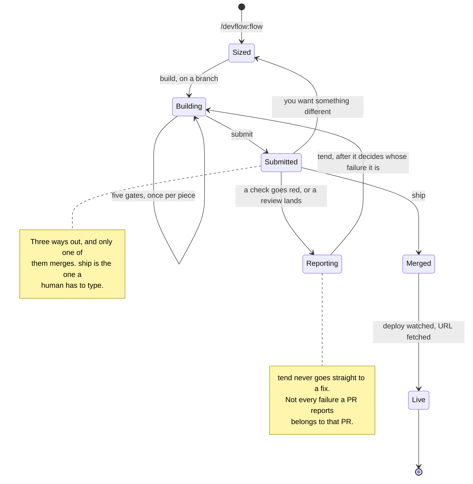
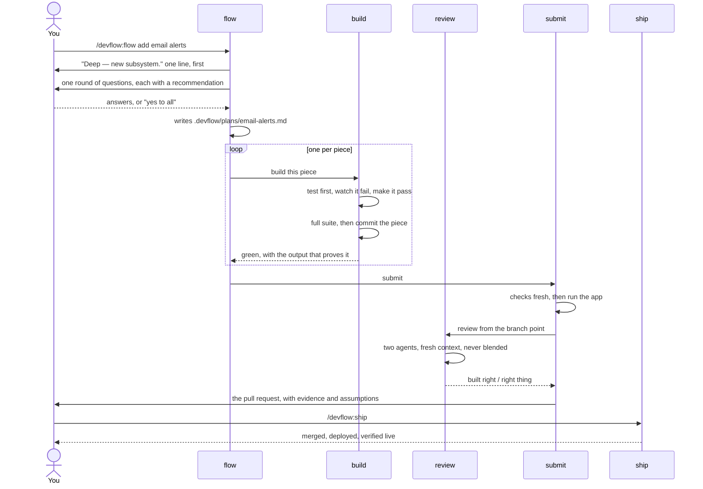

# The pipeline

Where a change can be, and which skill is allowed to move it.

## Why this is a state diagram

The README draws a flowchart, and a flowchart answers *what happens next*. That was the
right question while the loop ran in one direction — `flow`, `build`, `submit`, stop.

It stopped being the right question once the loop learned to come back. Work can now
return from an open pull request three separate ways, and a top-down flowchart draws
those as back-edges crossing the page. The picture gets harder to read exactly where the
plugin got more capable.

A state diagram asks a different question: **where can this work be sitting right now,
and what gets it out of there.** That turns out to be the question this plugin is
actually about. Every hole found in the audit was a missing transition — no way back
from an open PR, no way out of a red check — and a state diagram shows those as a state
with no exit. A flowchart hides them, because a line that was never drawn looks the same
as a line that does not exist.

Use the right one for the question. Sizing is a decision procedure, so the README's
flowchart still suits it. The pipeline is a lifecycle, so it gets this.

## The work

`setup` is not on here on purpose. It runs once per project, before any of this, and it
writes the `## Checks` block everything downstream trusts. It is not a state the work
passes through.

## One Deep job, end to end

The state diagram says where work rests. This says who hands what to whom — the thing
that is easy to get wrong, because `build` and `submit` split the commit between them.

Two things worth reading off it:

**`build` commits, but only a plan piece.** A Quick or Standard change is one piece and
`submit` commits it, after the checks and the review. A plan is several pieces across a
job long enough to outlive its own context, so each is committed as it lands and
`git log` becomes the record of which exist.

**Nothing reaches `ship` by itself.** The last arrow starts at you in every drawing of
this, and that is enforced in the harness rather than asked for in prose.

## Where a human is required

| Moment | Why it is yours |
|---|---|
| Answering `flow`'s questions | Skippable — "yes to all" takes every recommendation, and each one lands in the PR under **Assumptions** |
| Reading the PR | The artefact the whole loop exists to put in front of you |
| Typing `/devflow:ship` | The only skill that merges, and the only one nothing else can call |
| Saying "run the review" | On harnesses that block agents unless asked, this is the one thing that unblocks both axes |

Everything else runs without stopping to ask.
